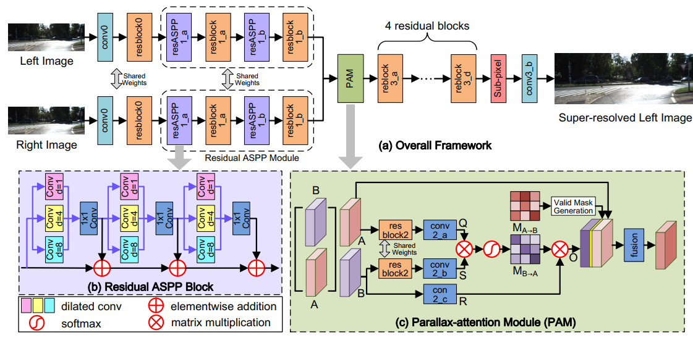
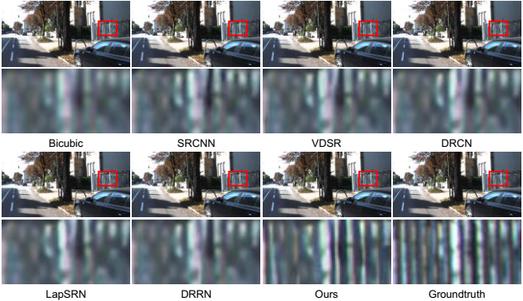
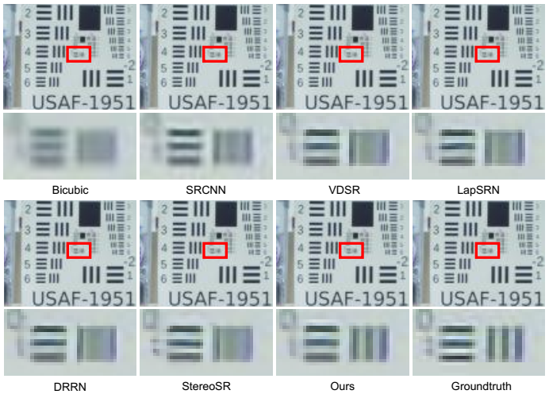

# PASSRnet: Parallax Attention Stereo Super-Resolution Network
Pytorch implementation of "Learning Parallax Attention for Stereo Image Super-Resolution", CVPR 2019

[[arXiv]](https://arxiv.org/abs/1903.05784) 

## Overview


Figure 1. Overview of our PASSRnet network.

</div>

Figure 2. Illustration of our parallax-attention mechanism. 

</div>

Figure 3. A toy example illustration of the parallax-attention and cycle-attention maps generated by our PAM.
The attention maps (30×30) correspond to the regions (1×30) marked by a yellow stroke. In (a) and (b), the first row
represents left/right stereo images, the second row stands for parallax-attention maps, and the last row represents cycle-attention maps.

## [Flickr1024 Dataset](https://yingqianwang.github.io/Flickr1024/)

</div>

Figure 4. The Flickr1024 dataset.

## Requirements
- pytorch (0.4), torchvision (0.2) (Note: The code is tested with `python=3.6, cuda=9.0`)
- Matlab (For training/test data generation)

## Train
### Prepare training data
1. Download the Flickr1024 dataset and put the images in `data/train/Flickr1024` 
(Note: In our paper, we also use 60 images in the Middlebury dataset as the training set.)
2. Cd to `data/train` and run `generate_trainset.m` to generate training data.

### Begin to train
```bash
python train.py --scale_factor 4 --device cuda:0 --batch_size 32 --n_epochs 80 --n_steps 30
```

## Test
### Prepare test data
1. Download the [KITTI2012](http://www.cvlibs.net/datasets/kitti/eval_stereo_flow.php?benchmark=stereo) dataset and put folders `testing/colored_0` and `testing/colored_1` in `data/test/KITTI2012/original` 
2. Cd to `data/test` and run `generate_testset.m` to generate test data.
3. (optional) You can also download KITTI2015, Middlebury or other stereo datasets and prepare test data in `data/test` as below:
```
  data
  └── test
      ├── dataset_1
            ├── hr
			 ├── scene_1
				      ├── hr0.png
					  └── hr1.png
			 ├── ...
		     └── scene_M
            └── lr_x4
                 ├── scene_1
					   ├── lr0.png
					   └── lr1.png
				 ├── ...
				 └── scene_M
      ├── ...
      └── dataset_N
```

### Demo
```bash
python demo_test.py --scale_factor 4 --device cuda:0 --dataset KITTI2012
```

## Results


Figure 5. Visual comparison for 2× SR. These results are achieved on “test_image_013” of the KITTI 2012 dataset and “test_image_019” of the KITTI 2015 dataset. 



Figure 6. Visual comparison for 4× SR. These results are achieved on “test_image_004” of the KITTI 2015 dataset.



Figure 7. Visual comparison for 2× SR. These results are achieved on a stereo image pair acquired in our laboratory.

## Citation
```
@InProceedings{2018-LearningforVideoSuperResolutionthroughHROpticalFlowEstimation-LongguangWang--,
  author    = {Longguang Wang and Yingqian Wang and Zhengfa Liang and Zaiping Lin and Jungang Yang and Wei An and Yulan Guo},
  title     = {Learning Parallax Attention for Stereo Image Super-Resolution},
  booktitle = {The IEEE Conference on Computer Vision and Pattern Recognition (CVPR)},
  year      = {2019},
}
```
## Contact
For questions, please send an email to wanglongguang15@nudt.edu.cn
